## はじめに

現在所属しているプロジェクトではWebAPIやバッチ処理の設計の一環としてPlantUMLを利用しています。効率よく品質高くアウトプットを出すためには、プログラミング言語に対してコーディング規約があるように、UMLに対してもチームで設計するにあたり一定のルールを決める必要があります。
そこでプロジェクト内のPlantUMLを使用するうえでのガイドラインやルールをまとめる機会があり、せっかくなのでそれを記事化します。

## 記事のゴール
- シーケンス図設計におけるPlantUMLの標準化
- 必要最低限のルールだけに絞ってチーム設計の生産性と品質を上げる

## 記事の前提
* ルールの想定の利用シーン：<br>チームで大量生産する業務機能の処理フローを表現するために使う場合を想定。<br>また、この記事に記載されているルールはRDBを中心的に使用したAPI処理やバッチ処理等を念頭に置き決められたものです。
* ルールの想定の効果：<br>PlantUMLを標準化/シンプル化することで設計者も、レビュアも少ないインプットで品質高く設計/レビュできようになる想定。
* ルールがカバーしている図の種類：<br>PlantUMLで様々な種類の図が作成できますがこの記事のスコープはシーケンス図に限った話になります。
* ルールに沿って作成されるシーケンス図に期待される最低限の役割：
  - 一目で機能全体の流れと大まかなロジックがわかる。
  - デバッグ、障害対応やパフォーマンスチューニングの第一ステップとして即座に調査ターゲットを絞り、問題の詳細設計やソースコードに導くヒントを与えてくれる。

## 書いてない内容
- PlantUMLってなに？→ https://plantuml.com/ja/
- PlantUMLで何ができる？→ http://plantuml.com/ja/guide
- そもそもなぜUML？→ https://qiita.com/laqiiz/items/fb7ad9dfb7430dd08455
- PlantUMLのセットアップ手順は？→ https://qiita.com/couzie/items/9dedb834c5aff09ea7b2<br>
  (セットアップの際はJAVAの環境変数の設定は忘れずに！参考：https://eng-entrance.com/java-install-env)<br>気軽にPlantUMLを使用したい方はブラウザからでもできます： https://www.planttext.com/

## 書いてる内容
- このルールに沿ってPlantUMLでシーケンス図を楽しく書いていきましょう！

## puファイルの基本
PlantUMLのファイル(pu)の中身は大体こんな感じです。
大きく、色等といった見た目を決める部分（L39より上）と、実際のシーケンスのフローを示す部分（L39より下）に分けられます。

なお、見た目を決める部分は別のコードは一つのconfigファイルに統一させることもできますが、ここはチームの管理の仕方に合わせてやりましょう。

上記のコードをレンダリングすると下記のような綺麗な図になります。


## 基本的な処理の書き方
### 矢印
処理が発生する箇所は矢印で表します。

- **シングルヘッド** - 処理がアクターを跨いで一方的になっているもの<br>（例：リクエスト送信、Queueに詰める処理等）

```plantuml single_head_example.pu
Client -> Backend: Request
```


- **ダブルヘッド** - 処理がアクターを跨いで双方的になっているもの<br>
（例：マスターチェック、DBアクセス処理等）

```plantuml double_head_example.pu
Backend <-> RDB: Master Check\n[Store Control Master]
```


- **リターニング** - 処理がアクターを跨がないもの<br>
（例：DBにアクセスせずJava内で完結するチェック処理等）

```plantuml returning_example.pu
Backend -> Backend: Add select result into Error List
```


### イベント

- **note** - 大きなイベントごとにnote毎で分けて見やすくします<br>（例：Parameter Check > Update t_status_history
> Process End）

```plantuml note_example.pu
note over Backend: 1. Parameter Check
```


### 分岐
シーケンス図内で分岐や条件付き処理を表したい場合は分岐の処理毎にAltで囲みます。

- **alt** - いわゆるifのような条件付き処理

```plantuml:alt_example.pu
Backend->Backend: Check A and B
alt If A
    Backend -> Backend: Add x to Error List
end
alt If B
    Backend <-> RDB: Insert x to A table
end
```


- **alt - else ①** - いわゆるif-elseのような分岐処理

```plantuml alt_else_example.pu
Backend->Backend: Check A and B
alt If A
    Backend -> Backend: Add x to Error List
else
    Backend <-> RDB: Insert x to A table
end
```


- **alt - else ②** - いわゆるif-else if-elseのような分岐処理

```plantuml alt_else_ifexample.pu
Backend -> Backend: Check something
alt If A
    Backend -> Backend: Add x to Error List
else If B
    Backend <-> RDB: Insert x to A table
else
    Backend -> Client: Response status code 422
end
```


### ループ
loopが発生した場合はloopで囲みます。<br>loopの右にはループを回す単位をFor Eachで記載する

- **loop**

```plantuml loop_example.pu
loop for each EPC
  Backend <-> RDB: Insert\n[t_sales]
end
```


### その他
- **採番のルール**<br>殆どの場合、シーケンス図はスタンドアロンではなく、一つ一つの処理の詳細（データアクセス定義、チェック定義、DB変更定義等）を図以外の場所に記載しますよね。そういった設計書内の詳細の記載とマッピングするために一個一個のフローステップにプロセスIDを付けます。プロセスIDの採番は下記のルールで実施します：
  + <font color="YellowGreen">処理が複数あった場合、階層が同じ処理は処理が発生する順に番号を振っていく</font>
  + <font color="LightCoral">直前の処理からaltで階層が深くなるたびにIDの桁に1を足し、１から始める</font>
  + <font color="LightSkyBlue">直前の処理からaltで階層が深くなると同時に、その階層に複数処理があった場合、IDの桁に2桁足す（深くなった理由での一桁と複数処理を分けるためのもう一桁）</font>

```pu id_example.pu
note over Backend: 2. Update Family Tree
loop for each New Member
    alt If Update Pattern = Any member
        Backend -> Backend: 2.1. Check DNA
        alt If DNA test returns success
            Backend <-> RDB: 2.1.1.1. Update\n[t_parent]
            Backend <-> RDB: 2.1.1.2. Update\n[t_child]
            Backend <-> RDB: 2.1.1.3. Update\n[t_grand_child]
        end
        alt If DNA test returns failure
            Backend -> Backend: 2.1.2. Add Member into Error List
        end
    end
end
```


- **改行**<br>文字の記載等で改行したい場合は`\n`を使いましょう。

```plantuml return_example.pu
loop for each EPC
  Backend <-> RDB: Insert\n[t_sales]
end
```


- **テーブル名**<br>DBアクセスが発生した場合はできる限り対象テーブルやデータを記載しましょう。<br>
テーブル名は[ ]に入れましょう。

```plantuml table_example.pu
loop for each EPC
  Backend <-> RDB: Insert\n[t_sales]
end
```


- **エラー**<br>エラーやエクセプションはAltで表現しましょう。

```plantuml error_example.pu
alt Error
    Backend -> Client: 1.4. Response status code 402
end
```


- **ロック**<br>ロックする場合は下記のように`Select Lock for [ロック解除の処理] [ロックするテーブル]`と記載する。<br>ただロックに関してはプロジェクトのロック方式などにもよるのでここはフレキシブルに。

```plantuml lock_example.pu
Backend <-> RDB: 2.2.1. Select\nLock for Update at 2.2.4\n[t_sales_header]
```


- **インデント**<br>インデントは基本しなくてもコードはレンダリングされるが、他の言語同様読みやすいように入れましょう。

- **色**<br>余談ですがPlantUMLのデフォルトカラーって良いと思う人、世の中あまりいないですよね。
これはもう、目に良いビジュアルに自分で変えていくしかないです。
色を変えるだけでだいぶ印象も変わってきます。ちなみに私のお気に入りは：
  + パレット①：<br>「puファイルの基本」で使ったサンプル図で使っているものです。グレーをベースにカラフルなアクセント、トイライクで見やすい（個人的な意見）パレットを作りました。<br>
      * `#FFFFFF`<span class="inline-code-color" style="background-color: #FFFFFF;"></span>（font1）
      * `#DDDDDD`<span class="inline-code-color" style="background-color: #DDDDDD;"></span>（background）
      * `#454645`<span class="inline-code-color" style="background-color: #454645;"></span>（font2、line）
      * `#FF6F61`<span class="inline-code-color" style="background-color: #FF6F61;"></span>（participant）
      * `#98DDDE`<span class="inline-code-color" style="background-color: #98DDDE;"></span>（database)
      * `#FFDA29`<span class="inline-code-color" style="background-color: #FFDA29;"></span>（entity）
      * `#98FB98`<span class="inline-code-color" style="background-color: #98FB98;"></span>（note）
  + パレット②：<br>「基本的な処理の書き方」で使ったサンプル図で使っているものです。使用する色が少ないなためシンプルでクリーンな資料と相性が良いです。バックグラウンドも白く、シーケンス図をWeb等に埋め込んで使う場合に適しており、ページと一体化して見えるので統一感があっておすすめです。<br>
      * `#FFFFFF`<span class="inline-code-color" style="background-color: #FFFFFF;"></span>（font1, background）
      * `#696969`<span class="inline-code-color" style="background-color: #696969;"></span>（line）
      * `#454645`<span class="inline-code-color" style="background-color: #454645;"></span>（font2）
      * `#FF6347`<span class="inline-code-color" style="background-color: #FF6347;"></span>（participant）
      * `#00FFFF`<span class="inline-code-color" style="background-color: #00FFFF;"></span>（database）
      * `#7FFFD4`<span class="inline-code-color" style="background-color: #7FFFD4;"></span>（note）
  + デフォルト：<br>もちろん、カラーにこだわりのない方はデフォルトでトラディショナルな白黒黄のコーディネートにすることができます。

（左から右：デフォルト、パレット②、パレット①）


コピペ用のテキストはこちらです。

🎨パレット1

```plantuml
@startuml Sample Diagram

skinparam BackgroundColor DDDDDD
skinparam shadowing false
skinparam RoundCorner 7
skinparam ArrowColor 454645
skinparam FontColor 454645
skinparam SequenceLifeLineBorderColor 454645
skinparam SequenceGroupHeaderFontColor 454645
skinparam SequenceGroupFontColor 454645
skinparam SequenceGroupBorderColor 454645
skinparam SequenceGroupBorderThickness 1
skinparam participant {
    BackgroundColor FF6F61
    BorderColor FF6F61
    FontColor White
}
skinparam database {
    BackgroundColor 98DDDE
    BorderColor 454645
    FontColor 454645
}
skinparam entity {
    BackgroundColor FFDA29
    BorderColor 454645
    FontColor 454645
}
skinparam note {
    BackgroundColor LightGreen
    BorderColor LightGreen
    FontColor 454645
}

entity Client
participant Backend
participant Queue
database RDB
entity "External"

@enduml
```

<details>
    <summary>パレット1のplantumlスニペット</summary>

</details>

🎨パレット2

```plantuml
@startuml Sample Diagram

skinparam BackgroundColor FFFFFF
skinparam shadowing false
skinparam RoundCorner 7
skinparam ArrowColor 454645
skinparam FontColor 454645
skinparam SequenceLifeLineBorderColor 696969
skinparam SequenceGroupHeaderFontColor 454645
skinparam SequenceGroupFontColor 696969
skinparam SequenceGroupBorderColor 696969
skinparam SequenceGroupBorderThickness 1
skinparam participant {
    BackgroundColor FF6347
    BorderColor FF6F61
    FontColor FFFFFF
}

skinparam database {
    BackgroundColor 00FFFF
    BorderColor 696969
    FontColor FFFFFF
}

skinparam note {
    BackgroundColor 7FFFD4
    BorderColor 7FFFD4
    FontColor 454645
}

participant Client
participant Backend
participant Queue
database RDB
participant External

@enduml
```

<details>
    <summary>パレット2のplantumlスニペット</summary>

</details>

### あえてルール化しなかったもの
はじめにも記載されている通り、記事のゴールとして「必要最低限のルールだけに絞ってチーム設計の生産性と品質を上げる」があります。上記で記載されたルールはシーケンス図が期待される必要最低限の役割を果たすために含めてたものです。したがって分岐やループ等、処理の柱となるロジックやパフォーマンスを表すものは記載必須としています。一方で、シンプル化のため、下記のものはあえてルールとしていません。

- **ライフライン**<br>ライフラインの活性化と破壊はシンプル化のため、あえて使いません。<br>こちらは`activate`、`deactivate`や`destroy`で表現できるので、必要に応じて。


- **線とアローヘッドの使い分け**<br>PlantUMLでは様々なアローヘッドや線の種類を指定することができます。「レスポンスは点線にする」等、世間ではアローヘッドと線の種類に関するいろんな使い分けが存在していますが、このルールではシンプル化のため、意識しません。こちらも必要に応じてやりましょう。


## おわりに
勝手にルールを決めちゃいましたがルールの中身よりもルールを決めることが大事だと思います。
これからPlantUMLを利用してチームで設計を始めたいけどルールを決めるのが面倒くさい方々、この記事をスタートラインにしてみてはいかが。

## 参考＆リンク
- https://plantuml.com
- https://qiita.com/laqiiz/items/fb7ad9dfb7430dd08455
- https://qiita.com/couzie/items/9dedb834c5aff09ea7b2
- https://eng-entrance.com/java-install-env)
- https://www.planttext.com/
- https://future-architect.github.io/articles/20190821/

