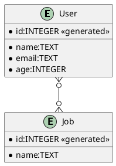

[前回の記事](/articles/20221027a/)ではMermaid.jsをレンダリングしましたが、次はPlantUMLをレンダリングしてみます。こちらも、前回のMermaid.js同様、メンテナンスされているPlantUML対応コンポーネントはありません。

PlantUMLもMermaid.js同様、多様なダイアグラムをサポートしています。しかし、PlantUMLはJavaで書かれており、一部C言語製のGraphvizにレイアウト処理を任せているようです。そのままの仕組みでGitHub Pagesのような静的HTMLで気軽に動かすことはできません。[Haxeで作り直してJavaScriptでも動かせるようにするPlantUML2](https://zenn.dev/newgyu/scraps/5bd12587744379)というのもあるようですが、まだまだ安定版ではなさそうです。

しかし、GitHub Pagesでプレビューを実現しているサイトは確かにあって、どうやっているのかと思っていたら、その仕組みについては[公式ページで紹介されていました](https://plantuml.com/ja/jquery)。plantuml.comにリクエストを投げて画像を生成していました。ソースコードを圧縮し、base64にして、それを末尾に付与したURLを作り、imgタグのsrcに入れるという方法です。

# ロジックを実装してみる

jQuery用のコードが上記のページで紹介されています。そのまま使えば動きはすると思いますが、いかんせんcjs形式でES6 modules形式でもなく、scriptタグで読み込む形式なので手を加えたいところ。そしてやっていることはdeflateの圧縮とbase64なので、より良いコードがnpmにあるので苦労はないだろう・・・と思ったらなかなかうまくいかず。

まずは高速という[pako](https://www.npmjs.com/package/pako)を使ってdeflateしてbtoaしたらplantuml.comがエラーに。次にzlib.jsとかいろいろ試したがダメ。で、ダメもとでbase64の部分をPlantUMLのサイトのコードを使ったらOKでした。で、再度pakoを使ったらOK。base64難しい。まあatobもいろいろdeprecatedであったりするのですが。最終形は以下の2つのコードになりました。このブログをかいているときに[plantuml-encoder](https://www.npmjs.com/package/plantuml-encoder)というのも見つけました。これもみたら同じような構成でした。

```ts encode64.ts
export function encode64(data: string) {
    let r = "";
    for (let i=0; i<data.length; i+=3) {
     if (i+2==data.length) {
      r +=append3bytes(data.charCodeAt(i), data.charCodeAt(i+1), 0);
     } else if (i+1==data.length) {
      r += append3bytes(data.charCodeAt(i), 0, 0);
     } else {
      r += append3bytes(data.charCodeAt(i), data.charCodeAt(i+1), data.charCodeAt(i+2));
     }
   }
   return r;
   }

   function append3bytes(b1: number, b2: number, b3: number) {
    let c1 = b1 >> 2;
    let c2 = ((b1 & 0x3) << 4) | (b2 >> 4);
    let c3 = ((b2 & 0xF) << 2) | (b3 >> 6);
    let c4 = b3 & 0x3F;
    let r = "";
    r += encode6bit(c1 & 0x3F);
    r += encode6bit(c2 & 0x3F);
    r += encode6bit(c3 & 0x3F);
    r += encode6bit(c4 & 0x3F);
    return r;
   }

   function encode6bit(b: number) {
   if (b < 10) {
    return String.fromCharCode(48 + b);
   }
   b -= 10;
   if (b < 26) {
    return String.fromCharCode(65 + b);
   }
   b -= 26;
   if (b < 26) {
    return String.fromCharCode(97 + b);
   }
   b -= 26;
   if (b == 0) {
    return '-';
   }
   if (b == 1) {
    return '_';
   }
   return '?';
}
```

```tsx PlantUML.tsx
import { useMemo } from "react";
import pako from "pako";
import { encode64 } from "../lib/encode64"

type ImageProps = JSX.IntrinsicElements['img'];

export function PlantUML(plops: ImageProps) {
    const { src, ...remained } = plops;

    const base64 = useMemo(() => {
        if (!src) {
            return "";
        }
        const bin = pako.deflateRaw(unescape(encodeURIComponent(src)));
        // https://stackoverflow.com/a/21214792
        const CHUNK_SIZE = 0x8000;
        let index = 0;
        const length = bin.length;
        const strs: string[] = [];
        while (index < length) {
          const slice = bin.subarray(index, Math.min(index + CHUNK_SIZE, length));
          // @ts-ignore
          strs.push(String.fromCharCode.apply(null, slice));
          index += CHUNK_SIZE;
        }
        return encode64(strs.join(''));
    }, [src])

    return src ?  : null;
};
```

最終系は、useMemoを使ってソースが変更されたときだけ変換計算をするようにしてみたのと、imgタグのさまざまな属性をそのまま受け取れるようにした感じです。`alt`属性とかのアクセシビリティ用属性もそのまま使える。

以下のコードから次の図が生成できるようになりました。




# 日本語対応

このままだと日本語を使うとエラーになってしまいます。とはいえ、PlantUMLのライブエディターを使うと日本語通ります。エラー画面を見ると文字化けしているようです。

検索すると、[テキストエンコーディング](https://plantuml.com/ja/text-encoding)のページがありました。ここを見ると、UTF-8でエンコードしろ、とあります。あと興味深かったのはBrotli圧縮形式にも対応しているとのこと。まあBrotliはnpmで検索しても使いやすいPure JS版はなかったのでDeflateのままにしておきます。

JavaScriptのオリジナルのUTF-16をUTF-8にするのは`TextEncoding`を使います。次のように圧縮の前に変換を実行するようにすれば日本語も通るようになります。

```diff tsx
- const bin = pako.deflateRaw(unescape(encodeURIComponent(src)));
+ const encoder = new TextEncoder();
+ const bin = pako.deflateRaw(encoder.encode(src));
```

ちなみに、`btoa`などの既存のbase64アルゴリズムが使えない理由も上記のページに書かれていました。歴史的経緯。

# plantuml.com以外のサーバー対応

これまでのコードは、plantuml.comの変換サーバーを使って表示を行っていました。何度もリクエストを送ってしまうのは申し訳ないので、ローカルで建てたサーバーなど、別サーバーも使えるようにします。

まずはローカルサーバーを起動します。　Dockerを使うのが簡単ですね。

```yaml docker-compose.yaml
version: '3'

services:
  plantuml:
    image: plantuml/plantuml-server:jetty
    ports:
      - 18080:8080
    restart: always
```

以下のように起動します。

```bash
$ docker compose up
```

次にファイルを変更します。この手の共通のパラメータをインジェクションするにはコンテキストを使うのが一番行儀が良いでしょう。まず`Context`を宣言しつつ、アプリ側に組み込むProviderをエクスポートします。

```diff plantuml.tsx
-import { useMemo } from "react";
+import { useMemo, createContext, useContext } from "react";

:

+const PlantUMLContext = createContext("http://www.plantuml.com/plantuml");
+
+export const PlantUMLProvider = PlantUMLContext.Provider;
```

コンポーネント内部では`useContext()`を使って設定値を取り出します。何も指定されていなかったら今まで通りのパスを使うようにします。

```diff tsx plantuml.tsx
 export function PlantUML(plops: ImageProps) {
     const { src, ...remained } = plops;

+    const serverUrl = useContext(PlantUMLContext) || "http://www.plantuml.com/plantuml";

:

-    return src ?  : null;
+    return src ?  : null;
 };
```

使う場合はルートの要素で変数を設定します。今回はNext.jsを使っているので、ここでは`NEXT_PUBLIC_PLANTUML_SERVER`環境変数から情報を取得するようにします。

```ts _app.tsx
+import { PlantUMLProvider } from '../components/plantuml'
+
 function MyApp({ Component, pageProps }: AppProps) {
-  return <Component {...pageProps} />
+  return (
+    <PlantUMLProvider value={process.env.NEXT_PUBLIC_PLANTUML_SERVER as string}>
+      <Component {...pageProps} />
+    </PlantUMLProvider>
+  )
 }
```

次のように環境変数を設定して実行すればローカルに建てたPlantUMLサーバーを利用します。Windowsだったらsetとかで環境変数してからnpm run devすれば大丈夫です。

```bash
$ NEXT_PUBLIC_PLANTUML_SERVER=http://localhost:18080 npm run dev
```

開発者ツールで見てみると、きちんとローカルホストのサーバーにアクセスしていることがわかります。


# まとめ

今回も最小の依存（deflateのpakoのみ）でPlantUML表示のコンポーネントが作れました。また、標準でお手頃なplantuml.comへのアクセス以外に、plantuml-serverのパスは切り替えられるようにもしてみました。

先ほどのMermaid.jsはGitHubでレンダリングされたり、確かにお手軽なのですが、例えばエンティティに日本語を入れるとか、ノードの色を変えるとか、テーマとか、表現力では圧倒的にPlantUMLですね。


